# Wstępna analiza danych

W niniejszym dokumencie przedstawiona jest wstępna analiza danych dla dwóch zbiorów danych: **Mushroom** oraz **Iris**. Analiza obejmuje identyfikację brakujących wartości, proporcje klas oraz rozkład cech z wykorzystaniem wykresów wygenerowanych wcześniej w Pythonie przy zastosowaniu biblioteki _matplotlib_.

---

## 1. Zbiór Mushroom

### Opis zbioru danych

Zbiór Mushroom zawiera informacje o grzybach, które klasyfikowane są na dwie klasy: **jadalne** lub **trujące**. Dane te zawierają różne cechy grzybów, takie jak kolor kapelusza, kolor łodygi, kształt, zapach, itp.

### Analiza brakujących wartości

```python
missing_values = mushroom_data.isnull().sum()
print("Brakujące wartości w kolumnach: ")
print(missing_values)
return missing_values
```

Przy pomocy powyższego kodu, sprawdzono, że dane nie zawierają braków.

### Proporcja klas

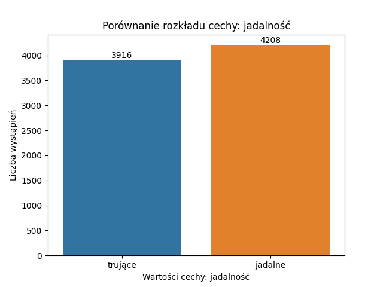

Powyższy wykres przedstawia ilość grzybów danej klasy.

### Rozkład cech

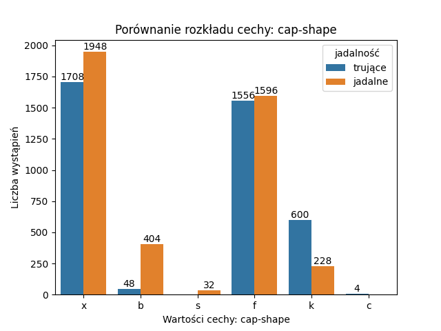

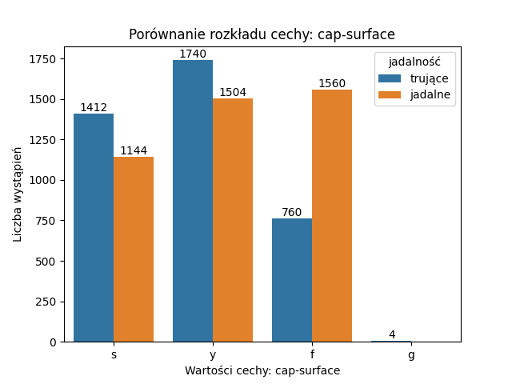

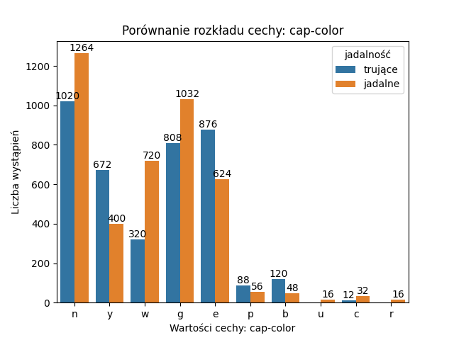

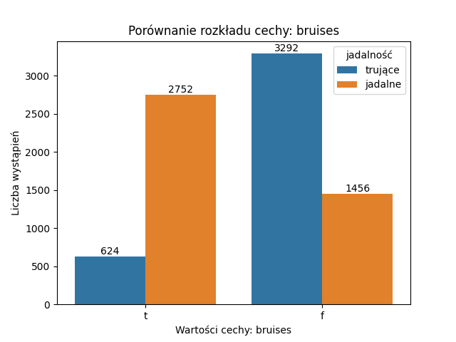

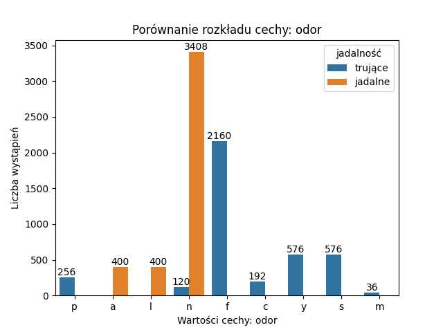

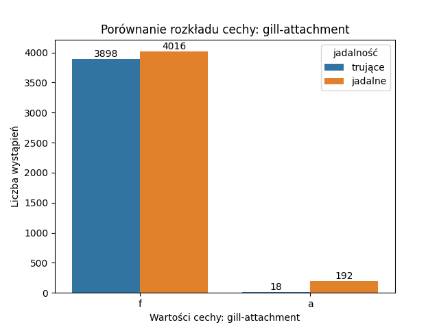

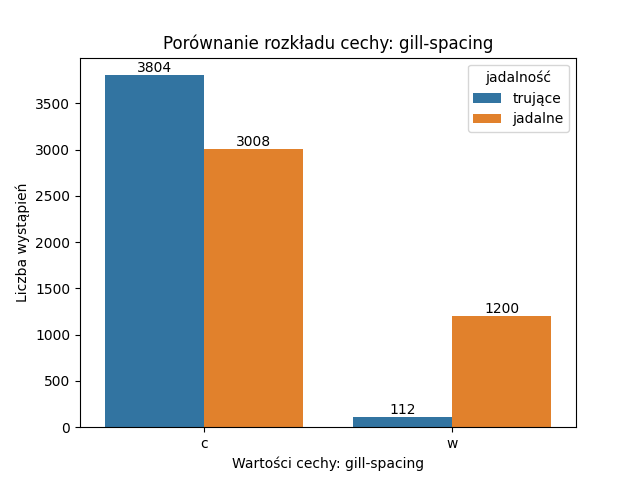

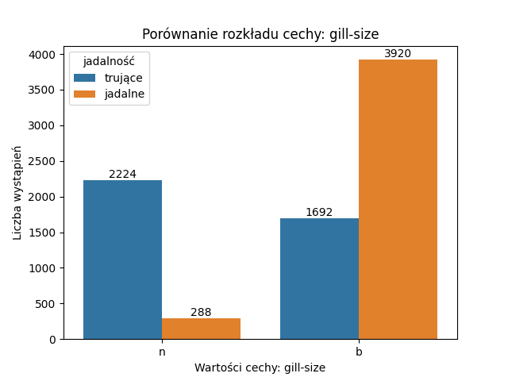

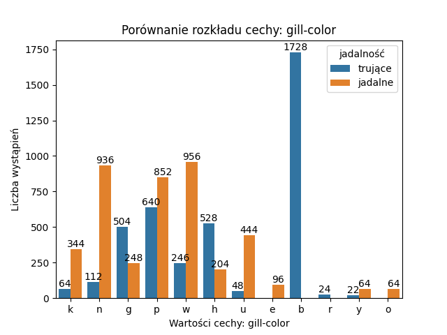

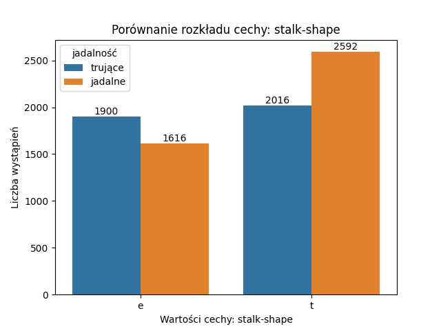

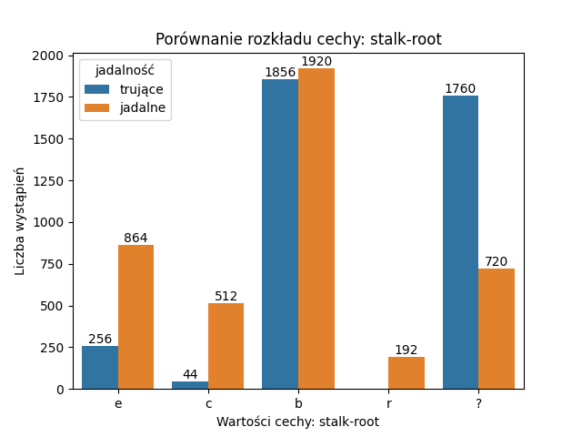

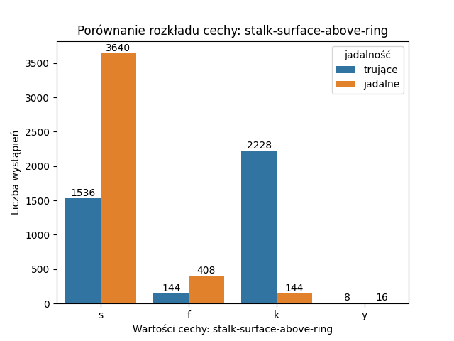

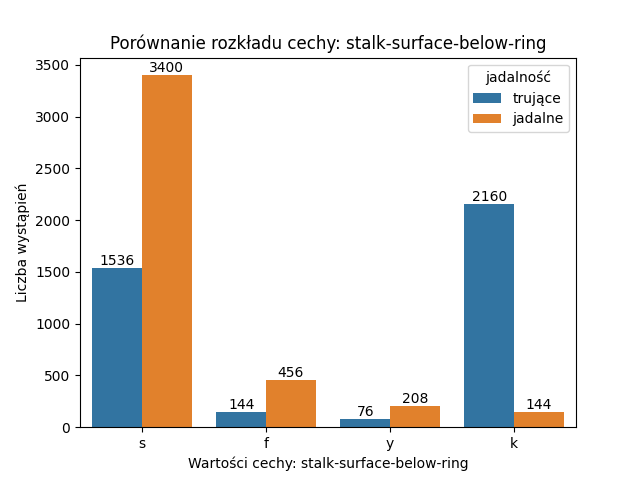

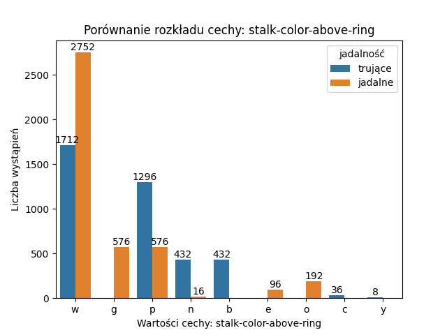

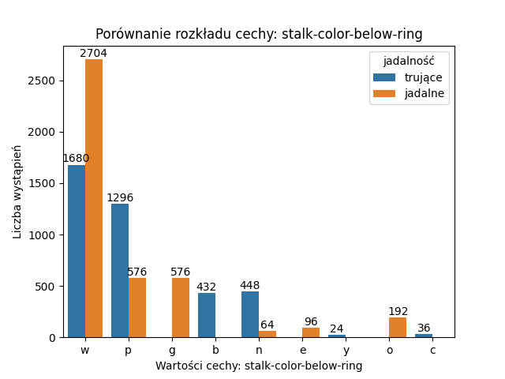

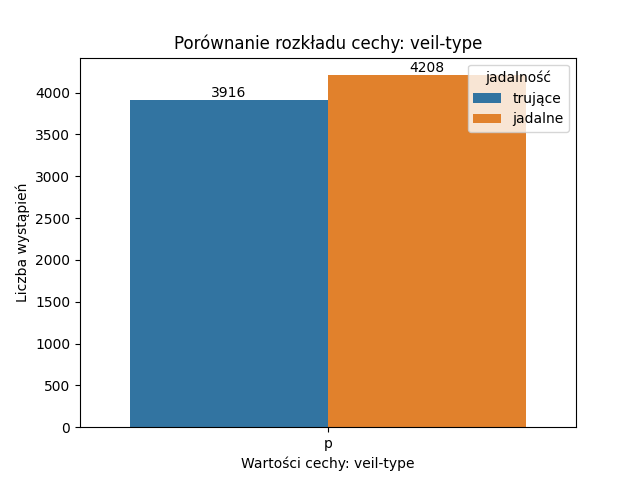

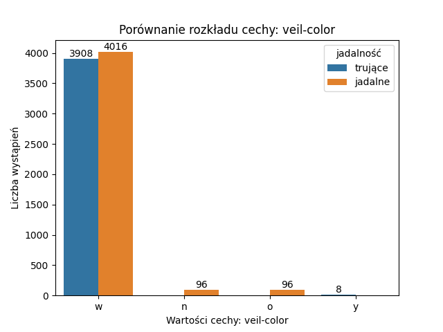

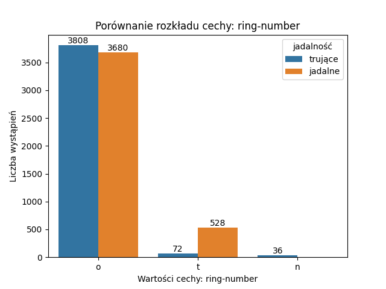

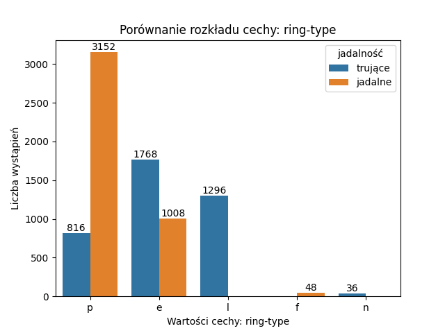

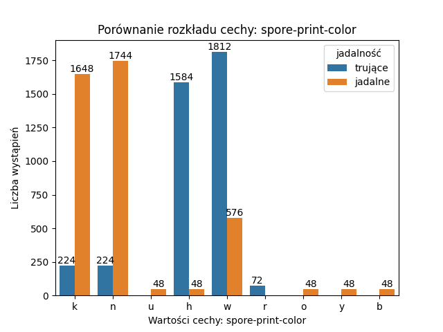

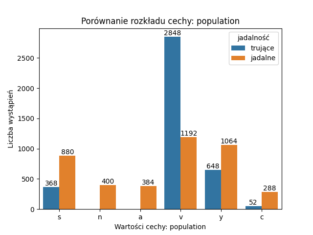

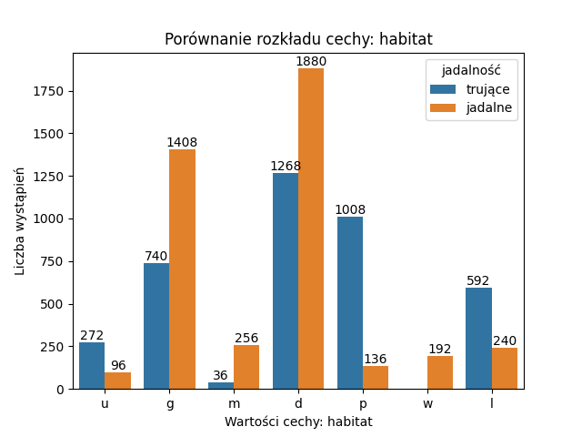

Powyższe wykresy przedstawiają rozkład ilościowy poszczególnych cech.

Na podstawie analizy wykresów możemy zauważyć, że szczególnie istotne w ocenie przynależności danego grzyba do klas są między innymi cechy: *_bruises_*, *_odor_*, *_gill-color_*, *_stalk-surface-above-ring_*, *_ring-type_*, *_spore-point-color_*,*_population_*.

Wśród podanych cech, możemy zauważyć częściej wyraźne wskazanie na klasę grzyba na podstawie wartości danej cechy.

Następujące wartości wśród cech determinują ze stuprocentowym prawdopodobieństwem klasę danego grzyba:

**cap-color**:
u 100% jadalne
r 100% jadalne
**cap-shape**:
s 100% jadalne
c 100% trujące
**cap-surface**:
g 100% trujące
**gill-color**:
e 100% jadalne
b 100% trujące
r 100% trujące
o 100% jadalne
**habitat**:
w 100% jadalne
**odor**:
p 100% trujące
a 100% jadalne
l 100% jadalne
c 100% trujące
y 100% trujące
s 100% trujące
m 100% trujące
**population**:
n 100% jadalne
a 100% jadalne
**ring-numer**:
n 100% trujące
**ring-type**:
f 100% jadalne
n 100% trujące
**spore-print-color**:
u 100% jadalne
r 100% trujące
o 100% jadalne
y 100% jadalne
b 100% jadalne
**stalk-color-above-ring_distribution**:
g 100% jadalne
b 100% trujące
e 100% jadalne
o 100% jadalne
c 100% trujące
y 100% trujące
**stalk-color-below-ring_distribution**:
e 100% jadalne
y 100% trujące
o 100% jadalne
c 100% trujące
**stalk-root_distribution**:
r 100% jadalne
**veil-color_distribution**:
n 100% jadalne
o 100% jadalne
y 100% trujące

## 2. Zbiór Iris

### Analiza brakujących wartości

```python
missing_values = iris_data.isnull().sum()
print("Brakujące wartości w kolumnach: ")
print(missing_values)
return missing_values
```

Przy pomocy powyższego kodu, sprawdzono, że dane nie zawierają braków.

### Proporcja klas

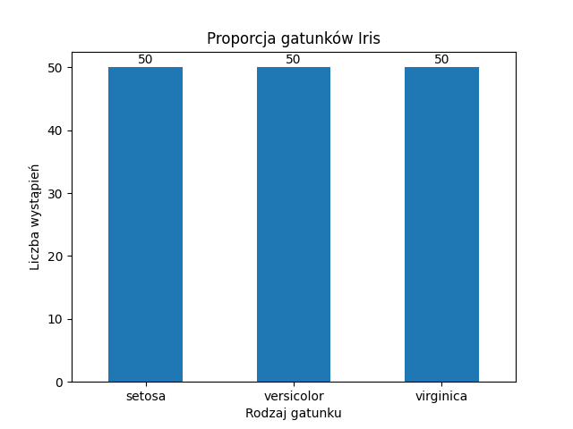

Powyższy wykres przedstawia ilość irysów danego gatunku.

### Rozkład cech

_distribution.png)

_distribution.png)

_distribution.png)

_distribution.png)

Powyższe wykresy przedstawiają rozkłady wartości poszczególnych cech irysów.

Na podstawie analizy powyższych histogramów, możemy stwierdzić, iż szczególnie istotne dla oceny przynależności danego kwiatu są cechy _*petal length*_ i _*petal width*_, gdyż wartości dla gatunku _*setosa*_ są wyraźnie odseparowane od gatunków _*versicolor*_ i _*virginica*_.

Wyraźne wzorce sugerujące podziały na gatunki występują dla klasy _*setosa*_. Wartości tej klasy wyróżniają się na tle innych klas, co sprawia, że klasa ta jest najłatwiejsza do sklasyfikowania.